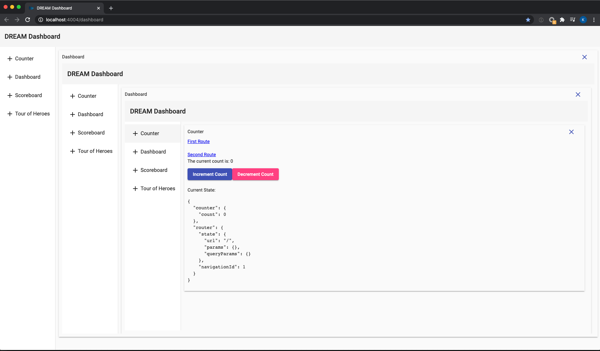

# Angular DREAM Stack
**D**OM-less **R**outing **E**ngine **A**llowing **M**adness.

## Motivation
This work was derived from a need for large enterprise internal facing applications to co-exist in a desktop like environment in the browser. The Angular Router was designed specifically for tying what is shown on the page to the location in the Browser.
However, in some instances this can be behavior that is not desired. A good example of this is a dashboard with complex and rich widgets (charting, single metric, session tracing tools, etc).
The default routing solution works really well until a widget such as a graph (with multiple routes) needs to be rendered multiple times on the page for different metrics.

## Quick Start

Run `yarn run-all` to get all MFEs running,

Navigate to all below locally to see each application is able to open separately.

http://localhost:4001 - Counter

http://localhost:4002 - Scoreboard

http://localhost:4003 - Tour of Heroes

After verifying, navigate to http://localhost:4004 to play around with the Dashboard

## The Solution

### Sandboxing via Injector

Due to the power of Angular's Dependency Injection, we can create an isolated injector per widget. We can accomplish this by creating a custom service that provides code-splitting for each widget. This is accomplished by using the widget host component as the parent injector for each widget.

### Allowing for Multiple Routers and Ngrx Stores

When we create our sandbox, we will also need to provide our own ["override"](https://github.com/kylecannon/angular-dream-stack/blob/master/libs/app-utils/src/lib/app-loader.service.ts) for `Router` and `Store` and `PlatformLocation`. Overriding the PlatformLocation at the widget level is the key to allowing multiple routers to exist. The parent (root app router) will still have it's default behavior of deep linking, but the widgets will use an ["in memory"](https://github.com/kylecannon/ngx-dashboard-widget-sandbox-example/blob/master/src/app/widget-utils/widget-platform-location.ts) url.

### App Inception

Since each application has a sandboxed instance of the Router and Ngrx, we can have the application render a new instance of itself in itself.  

### Release the entire application as SPA and MFE App 

Let's say we wanted to release the [counter](https://github.com/kylecannon/angular-dream-stack/tree/master/libs/counter) as a single page app but also release it in our MFE Dashboard. 
By taking what would be considered the `AppModule` and migrating it into a "library" will allow for the build process to consume the core functionality for two separate distribution styles.

1) The [AppModule](https://github.com/kylecannon/angular-dream-stack/blob/master/apps/mfe-counter/src/app/app.module.ts) is now responsible properly bootstrapping the application for SPA distribution.
   It's sole responsibility is NgModule that imports the [CounterModule](https://github.com/kylecannon/angular-dream-stack/blob/master/libs/counter/src/lib/counter.module.ts#L58) and has its own bootstrapped [AppComponent](https://github.com/kylecannon/angular-dream-stack/blob/master/apps/mfe-counter/src/app/app.component.ts#L8) that [invokes](https://github.com/kylecannon/angular-dream-stack/blob/master/apps/mfe-counter/src/app/app.component.html#L11) the [CounterContainerComponent](https://github.com/kylecannon/angular-dream-stack/blob/master/libs/counter/src/lib/counter-container/counter-container.component.ts).
2) The [MfeAppModule](https://github.com/kylecannon/angular-dream-stack/blob/master/apps/mfe-counter/src/app/mfe-app.module.ts) is responsible for creating a NgModule that implements the [LoadableApp](https://github.com/kylecannon/angular-dream-stack/blob/master/libs/app-utils/src/lib/loadable-app.ts#L3) interface that provides the EntryComponent to be [rendered in](https://github.com/kylecannon/angular-dream-stack/blob/master/libs/app-utils/src/lib/render-app.directive.ts#L34) as a Federated Module. 
   The `MfeAppModule` EntryComponent references the same [CounterContainerComponent](https://github.com/kylecannon/angular-dream-stack/blob/master/libs/counter/src/lib/counter-container/counter-container.component.ts#L11) that was used for the SPA distribution, allowing for multiple distribution types of the same application.

## Current Shortcomings

* Hovering over a `<a [routerLink]="...">...</a>` will present a URL in the browser that will not work.
  * Should not be used with Angular Universal or any public facing site due to this. 
  * Can become more supported by working with Angular team.
* Functionality such as `window.history.back()` and `window.history.forward()` do not work since we essentially ripped out all communication with the browser.
* To be successful with isolation with providers that hold state, refrain from using `@Injectable({ providedIn: '...' }}` syntax to avoid the compiler hoisting to an injector out of the sandbox. 
